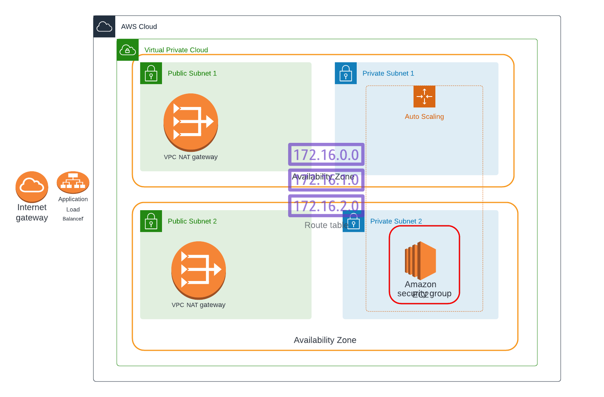
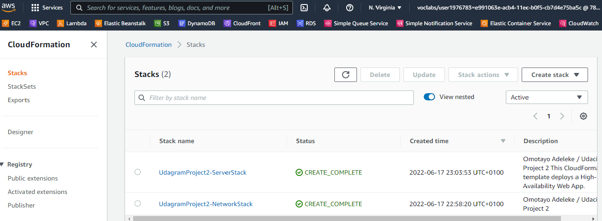
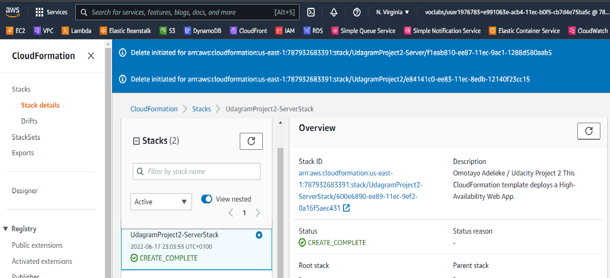
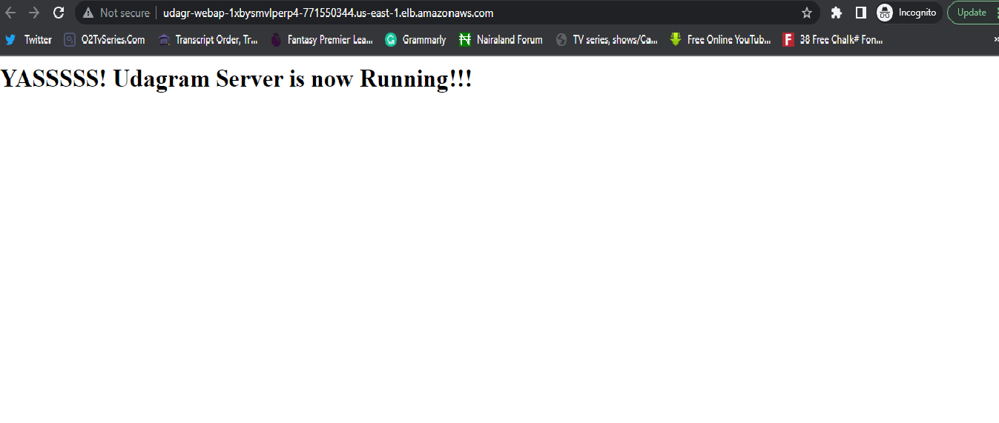

# A High Availability WebApp Deployed with CloudFormation

# Contents

## udagramproject-network.yml
This is a template that bears every network resources deployed. Not to run into any error, it is advised that this file is deployed first.

## udagramproject-server.yml
This is a template that has the app resources set for deployment. It inherits parameters from the first file deployed and should be deployed after udagramproject-network.yml.

## udagramproject-parameters
It has reusable parameters to make future deployment easy.

## Prerequisites
An AWS account
#

## What to run
Create a CloudFormation network stack with:
`aws cloudformation create-stack --stack-name someStackName --template-body file://udagramproject-network.yml --parameters file://udagramproject-parameters.json`
#
Create the CloudFormation server stack like so:
`aws cloudformation create-stack --stack-name someStackName --template-body file://udagramproject-server.yml --parameters file://udagramproject-parameters.json`

## Server output
The server is accessible through this Address:
http://Udagr-WebAp-1XBYSMVLPERP4-771550344.us-east-1.elb.amazonaws.com
#

#

#

#

